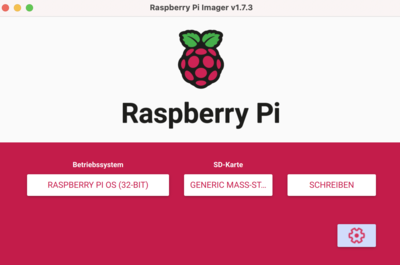
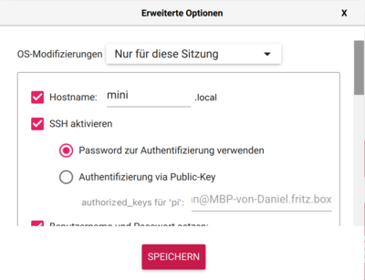
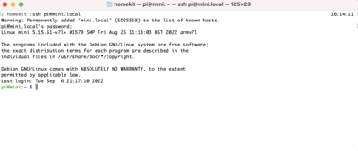

# raspberry pi 

## installation

Best thing to start is using the Raspberry Pi Imager. 
https://www.raspberrypi.com/software/

- select your OS (default raspberry pi image) 
- select your sd card
- go to settings to set your hostname, wlan credentials, activate ssh and so on

If all is okay just click on write and wait...



  


Now the card is prepared so just put it into your pi and turn it on.

## connect via ssh

As you can see in the screen above I set the hostname to **mini.local**. Connction via ssh should be like

```
ssh pi@mini.local
```


### mini.local required packages

install chromium browser (might be already installed)
```
sudo apt-get install chromium-browser
```

install unclutter to get rid of mouse cursor

```
sudo apt-get install unclutter
```

now prepare for building dashboard and homekit accessories with node.

```
curl -o- https://raw.githubusercontent.com/nvm-sh/nvm/v0.38.0/install.sh | bash

# maybe run the export statement displayed in the console

nvm install v18.9.0
```


### dashboard installation

```
cd ~
git clone https://github.com/danielkagemann/raspberry-dashboard.git
cd raspberry-dashboard
yarn install
cd webserver 
yarn install
cd ..
yarn build:all
```

Add start of webserver into /etc/rc.local

```
sudo nano /etc/rc.local
(cd /home/pi/raspberry-dashboard/webserver/build; node index.js&)
```

Open browser and type http://mini.local

you should see the dashboard


Use portrait mode by adding `?portrait=1` to the url.

### prepare autostart

open file in editor

```
sudo nano /etc/xdg/lxsession/LXDE-pi/autostart
```

and add the following lines to it.

```
@unclutter
@xscreensaver -no-splash
@xset s off
@xset -dpms
@xset s noblank
# start chromium fullscreen in icognito and kiosk mode
@chromium-browser --incognito --kiosk http://localhost:8080?portrait=1
```

## virtual homekit accessories

### hk-athome

Prepare the storage folder

```bash
mkdir /homekit
sudo chmod 777 /homekit
```

```bash
git clone https://github.com/danielkagemann/hk-athome.git
```

Go to the project directory

```bash
cd hk-athome
```

Install dependencies

```bash
yarn install
```

Build and deploy to /homekit. This copies all data to /homekit.

```bash
yarn build
yarn deploy
```

Add to autostart

```bash
sudo nano /etc/rc.local
(cd /homekit; node athome.js > /homekit/athome.log &)
```

Now you should be able to add this Switch to your homekit environment via PIN code.
Please use code 300-92-008.

## alerts

you can show alerts by just sending a request. it does not matter 
if the request is send by automation or manually.

```
POST http://mini.local:8080/v1/message
Content-Type: application/x-www-form-urlencoded
type=<typeofmessage>&message=<text>
```
where typeofmessage can be error, info or dark

e.g. via curl

```bash
curl -X POST http://mini.local:8080/v1/message -H "Content-Type: application/x-www-form-urlencoded" -d "type=info&message=hi"
```

## Troubleshooting

Please ensure that the network is 2,4Ghz.

If you still can connect via ssh you can use the commandline tool

```
sudo raspi-config
``
